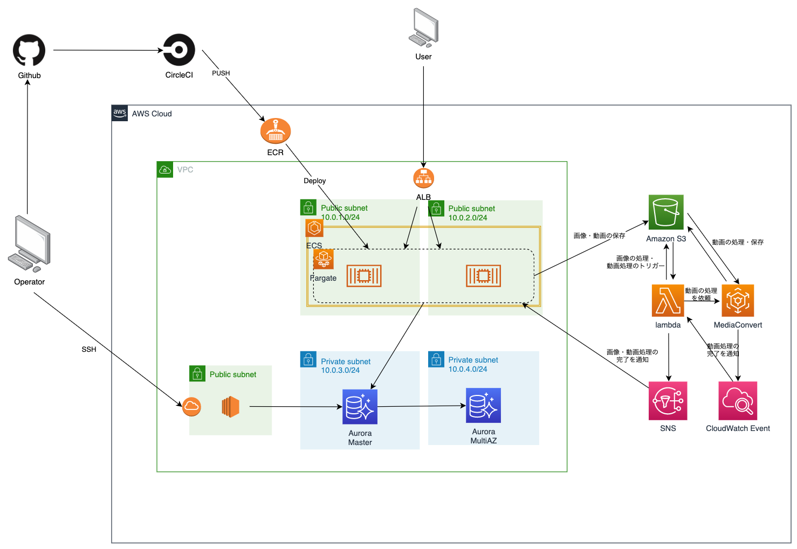
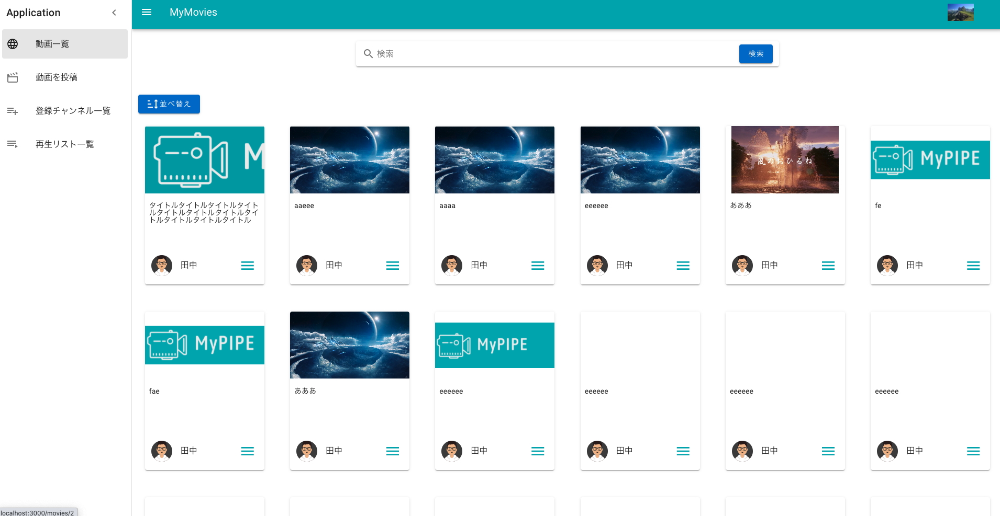
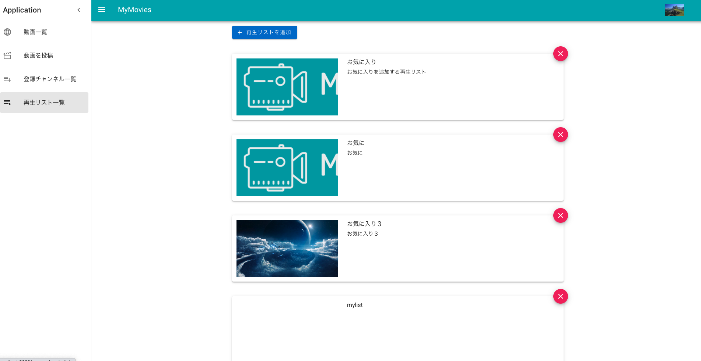
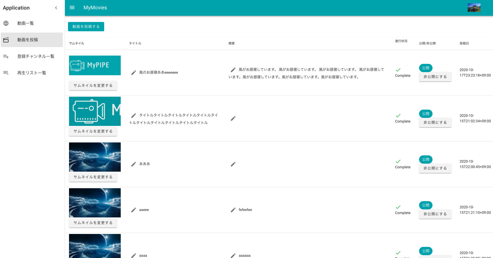
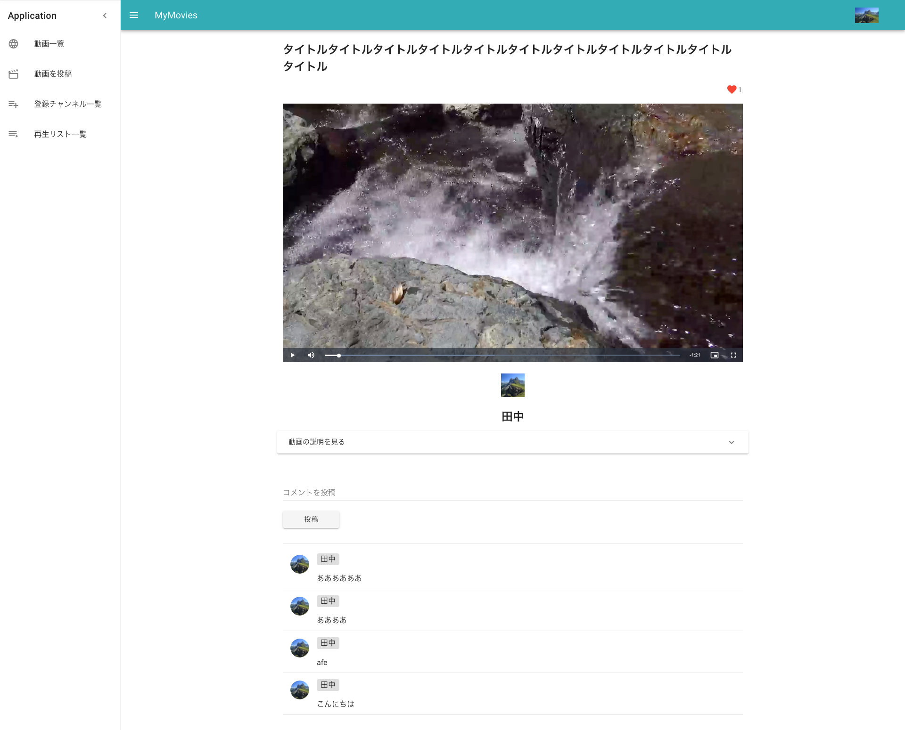

# MyMovies(作成中)
動画の投稿・閲覧ができるシンプルなサービスです。  

## URL
https://www.frommymovies.com/

## 使用言語
Go言語  
Nuxt(https://github.com/takatsu111/MyPIPE-front)

## 使用技術(実装予定も含む)
Docker・・・コンテナを使って開発環境の構築・本番環境へデプロイ  
Nginx・・・リクエストをAPIへ渡す・レスポンスをクライアントへ返す  
VPC・ECR・ECS(Fargate)・ALB・・・デプロイする環境の構築  
Lambda・・・MediaConvertでの動画処理を開始させる。動画処理の完了を通知する。  
MediaConvert・・・動画ファイル(mp4・mov)をHLS用のファイル(m3u8・ts)に変換する  
AuroraDB(MySQL互換)・・・データの保存  
CircleCI・・・テスト・デプロイの自動化

## AWS構成図
 

## 進捗(スクリーンショット)
### 動画一覧  
  
### 再生リスト一覧  
  
### 投稿動画一覧  
  
### 再生画面
  

## 設計方針(ディレクトリ構造)
goのソースコードは、 /go/src/MyPIPEに作成していく  
main.goにルーティングを作成していく。
### /go/src/MyPIPE/domain
ビジネスルール・仕様の関心事を取り扱う。  
User structやComment structをドメインオブジェクトとして実装。

### /go/src/MyPIPE/handler
リクエストデータを受け取り、加工したものをusecase層にデータを渡す。

### /go/src/MyPIPE/infra
永続化のための具体的な技術を実装する。

### /go/src/MyPIPE/usecase
ソフトウェアの行なう仕事の流れを表現する。
